# Подорож до Стародавньої Греції

#### Опис


Продовжимо нашу подорож Стародавнім світом, де наступною зупинкою буде Стародавня Греція! На цьому занятті ми згадаємо абсолютні координати і за їхньою допомогою створимо своє море і острів. Розберемося в сторонах світла і навчимося робити компас.


## Згадаймо🤔

1. Що таке абсолютні координати?&#x20;
2. Навіщо нам потрібні абсолютні координати?&#x20;
3. За допомогою яких блоків можна задати абсолютні координати?

## Сьогодні ми:

1. Створимо та осушимо море в абсолютних координатах.&#x20;
2. Створимо острів у морі.&#x20;
3. Розберемося зі сторонами світла.&#x20;
4. Створимо компас на землі.&#x20;
5. Створимо компас на острові із піску.

> **Усі ці навички обов'язково знадобляться під час виконання вашого проєкту!**😉

## Завдання 1


Ми плавно рухаємося хвилями історії, і сьогодні нарешті дісталися Стародавньої Греції!&#x20;

У давньогрецькій міфології одним із трьох головних богів-олімпійців разом із Зевсом та Аїдом був морський бог Посейдон. Море мало велике значення для греків: торгівля, рибальство, видобуток дорогоцінних раковин та багато іншого.&#x20;

Сьогодні ми з вами поринемо в морську історію Стародавньої Греції та створимо своє невелике море 🌊


| **Завдання**  | <ol><li>Створіть <strong>море у координатах Гравця</strong>, яке з’явиться при команді чату «Море» від точки <strong>(10; -1; 10)</strong> до точки <strong>(40; -1; 40)</strong></li><li>Телепортуйте себе в це море</li></ol>         |
| ------------- | --------------------------------------------------------------------------------------------------------------------------------------------------------------------------------------------------------------------------------------- |
| **Код**       |     |
| **Результат** |  |

## Додаткове завдання

| **№**         | **1**                                                                                                                                                                                                                                                                                                                          |
| ------------- | ------------------------------------------------------------------------------------------------------------------------------------------------------------------------------------------------------------------------------------------------------------------------------------------------------------------------------ |
| **Завдання**  | <ol><li>Створіть море від точки <strong>(10;-61;10)</strong> до точки <strong>(-10;-61;-10)</strong>.</li><li>Створіть море від точки <strong>(-30;-61;-30)</strong> до точки <strong>(-50;-61;-50)</strong>.</li><li>Створіть море від точки <strong>(50;-61;50)</strong> до точки <strong>(100;-61;100)</strong>. </li></ol> |
| **Код**       | 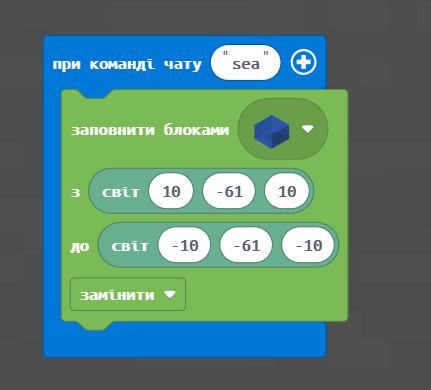                                                                                                                                                                                                                                                                  |
| **Результат** | .png>)                                                                                                                                                                                                                                                                                          |


Ми з вами створили море, а тепер поексперементуймо і «осушимо» його. Для цього потрібний простір, який займала вода, заповнити повітрям. У результаті отримаємо відповідне поглиблення.


| **№**         | **2**                                                                                                                                                                                                                                                                                                                                                                                                                                                                                                                                                                                                                                  |
| ------------- | -------------------------------------------------------------------------------------------------------------------------------------------------------------------------------------------------------------------------------------------------------------------------------------------------------------------------------------------------------------------------------------------------------------------------------------------------------------------------------------------------------------------------------------------------------------------------------------------------------------------------------------- |
| **Завдання**  | <ol><li>При команді чату <strong>sea</strong> створіть море від точки <strong>(10; -61; 10)</strong> до точки <strong>(-10; -61; -10)</strong>. При команді чату nosea — «осушіть» море (заповніть простір для води блоками повітря) </li><li>При команді чату <strong>sea2</strong> створіть море від точки <strong>(-30; -61; -30)</strong> до точки <strong>(-50; -61; -50)</strong>. При команді чату nosea2 — «осушіть» море </li><li>При команді чату <strong>sea3</strong> створіть море від точки <strong>(50; -61; 50)</strong> до точки <strong>(100; -61; 100)</strong>. При команді чату nosea3 — «осушіть» море</li></ol> |
| **Код**       | 

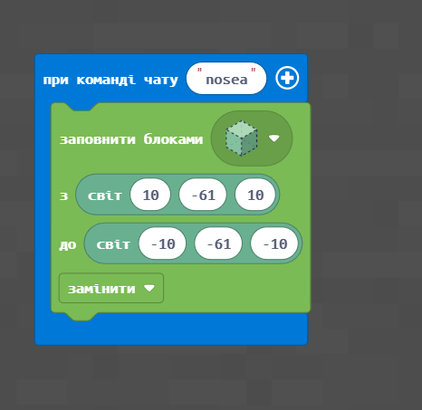
                                                                                                                                                                                                                                                                                                                                                                                                                                                                                               |
| **Результат** | 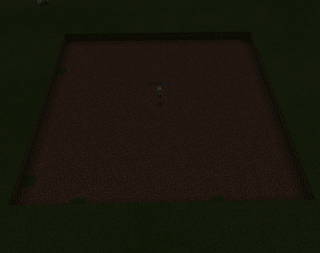                                                                                                                                                                                                                                                                                                                                                                                                                                                                                                                                                                                                     |

Також можна не просто «прибирати воду», а заповнити це поле, наприклад, травою:

|            |                                                               |
| ---------- | ------------------------------------------------------------- |
| Код:       | 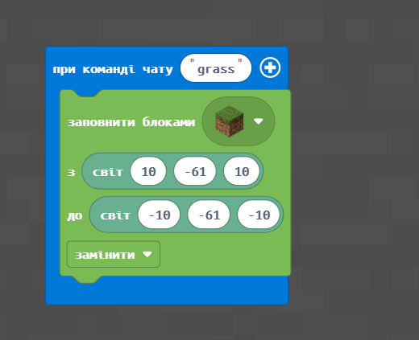 |
| Результат: | 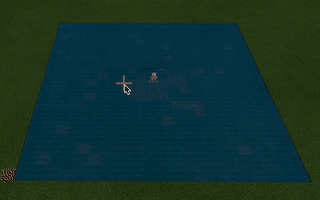                                |


Стародавня Греція лише частково збігається із територією сучасної Греції. В один зі своїх бурхливих періодів розвитку територія Стародавньої Греції займала південь Балканського півострова з островами Егейського моря, що приєднуються зі сходу, узбережжя Фракії, західне узбережжя Малої Азії і частину острова Кіпр.&#x20;

Якщо ви подивитеся на карту, то побачите, що Стародавня Греція мала у своєму складі безліч островів. Тож створімо з вами невеликий острівець🏝


Якщо при створенні моря ви заповните простір не повністю, то у вас вийде острів:

|           |                                                               |
| --------- | ------------------------------------------------------------- |
| Код:      | 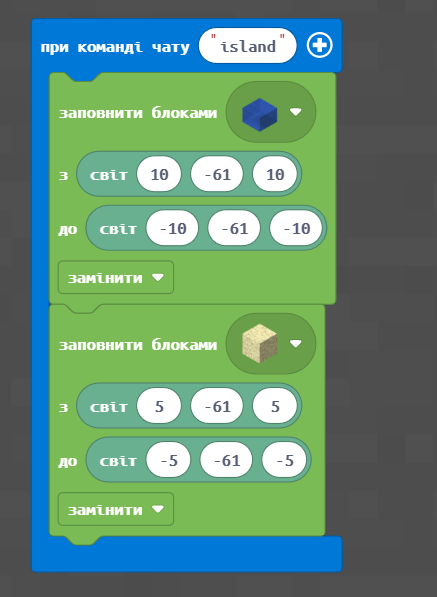 |
| Результат | .png>)                         |

## Гра "[Лабіринт для Агента](https://makecode.com/\_C5wL7xCJvJMh)"

|            |                                                                                                                                                                                                                 |
| ---------- | --------------------------------------------------------------------------------------------------------------------------------------------------------------------------------------------------------------- |
| Завдання:  | Створити гру «Лабіринт для агента» на острові                                                                                                                                                                   |
| Код:       | 
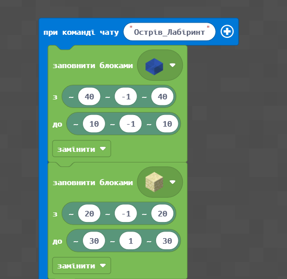

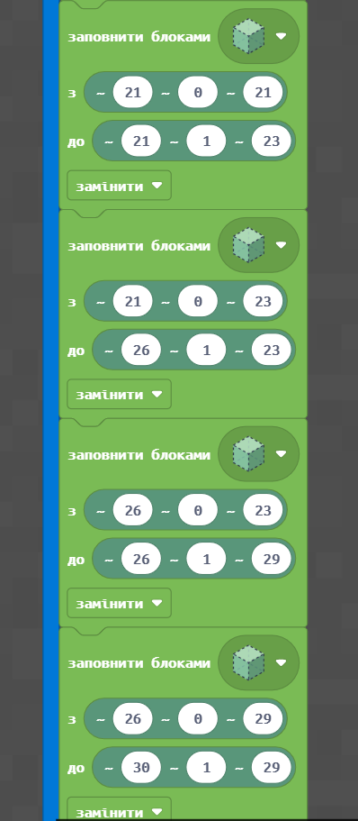

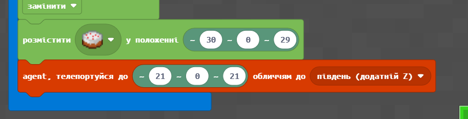
 |
| Результат: | 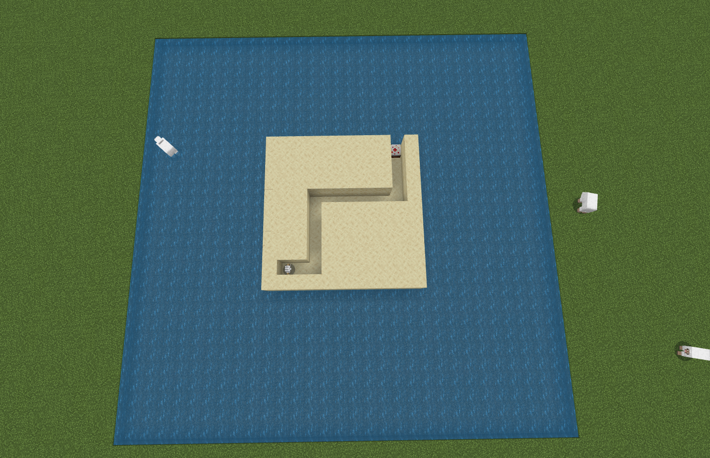                                                                                                                                                  |

Тепер нам залишилося тільки додати команди для керування нашим Агентом та зіграти в гру:

<figure>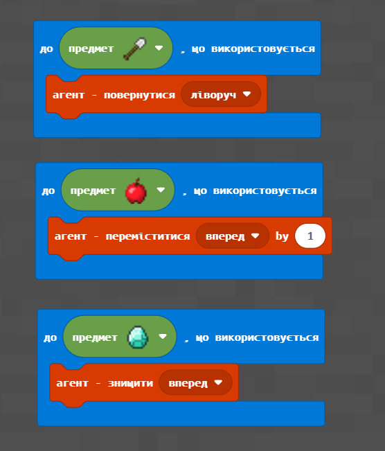<figcaption></figcaption></figure>

### Додаткове завдання:

|            |                                                                                                    |
| ---------- | -------------------------------------------------------------------------------------------------- |
| Завдання:  | Додати до гри «Лабіринт для агента» відлік зворотного часу                                         |
| Код:       |                                  |
| Результат: |  |

## Сторони світу

У Minecraft існують **сторони світла**. Визначити сторони світла у самій грі можна так само, як і реальному світі:


Сонце сходить на сході. Якщо стати лицем Схід, то ззаду буде захід, ліворуч — північ, праворуч — південь.


Також у Minecraft можна орієнтуватися за координатами:

.png>)


Позитивний напрямок осі X (першої координати) — це схід. А негативне — захід.&#x20;

Позитивний напрямок осі Z (третьої координати) — це південь. А негативне — це північ.


| **№**         | **3**                                                                                                                                                                                                                                                                                                                                                                                                                                                                                                                                                                                                                                                                                         |
| ------------- | --------------------------------------------------------------------------------------------------------------------------------------------------------------------------------------------------------------------------------------------------------------------------------------------------------------------------------------------------------------------------------------------------------------------------------------------------------------------------------------------------------------------------------------------------------------------------------------------------------------------------------------------------------------------------------------------- |
| **Завдання**  | <ol><li>Поставте агента в точку <strong>(0; -60; 0)</strong> орієнтацією на схід і встановіть час <strong>«Світанок»</strong>. </li><li>Поставте агента в точку <strong>(30; -60; 30)</strong> орієнтацією на північ і встановіть час <strong>«полудень»</strong>. </li><li>Поставте агента в точку <strong>(10; -60; 10)</strong> орієнтацією на захід і встановіть час <strong>«Захід».</strong> </li><li>Поставте агента в точку <strong>(0; -60; -10)</strong> орієнтацією на південь і встановіть час <strong>«Опівночі»</strong>. </li><li>Поставте агента на 10 блоків на південь і на 5 на схід від координати (<strong>0</strong>;<strong>-60</strong>;<strong>0</strong>)</li></ol> |
| **Код**       | 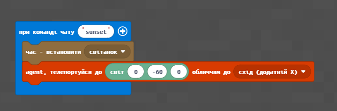                                                                                                                                                                                                                                                                                                                                                                                                                                                                                                                                                                                                                                |
| **Результат** | .png>)                                                                                                                                                                                                                                                                                                                                                                                                                                                                                                                                                                                                                                                         |

## Компас


У Стародавній Греції звичайно було дуже поширене мореплавання. І на початку люди не мали якихось особливих технологій, щоб орієнтуватися в безмежному водному просторі. Стародавні греки навчилися слідувати за хмарами, запахами та звуками, які можуть поширюватися далеко в море, а вночі моряки орієнтувалися на зірки.&#x20;

Компас є одним з найважливіших наукових відкриттів у галузі навігації. Греки незалежно від інших учених самостійно виявили та досліджували явище магнетизму, а потім створили свій перший компас.


Зробімо орієнтацію на світлі на землі:

<figure><figcaption></figcaption></figure>

| **№**          | **4**                                                                                                                                                                                                                                                                                                                                                                                                                          |
| -------------- | ------------------------------------------------------------------------------------------------------------------------------------------------------------------------------------------------------------------------------------------------------------------------------------------------------------------------------------------------------------------------------------------------------------------------------ |
| **Завдання:**  | <ol><li>Створіть компас з напрямками довжиною <strong>5 блоків</strong> з точкою з алмазного блоку в точці <strong>(0;-61;0)</strong> </li><li>Створіть компас з напрямками довжиною <strong>5 блоків</strong> з точкою із золотого блоку в точці <strong>(10;-61;10)</strong> </li><li>Створіть компас з напрямками довжиною <strong>3 блоки</strong> з точкою з блоку каменю в точці <strong>(20; -61; 0)</strong></li></ol> |
| **Код:**       | 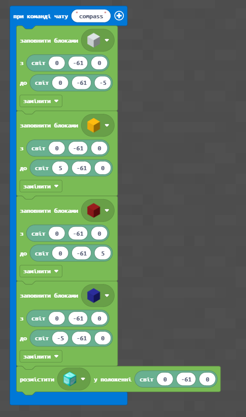                                                                                                                                                                                                                                                                                                                                                                 |
| **Результат:** | .png>)                                                                                                                                                                                                                                                                                                                                                                                          |

Давайте трішки вдосконалимо наш компас й додаймо підпис кожної сторони:

|            |                                                                |
| ---------- | -------------------------------------------------------------- |
| Код:       | 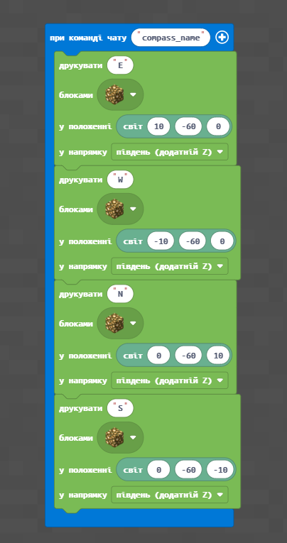 |
| Результат: | 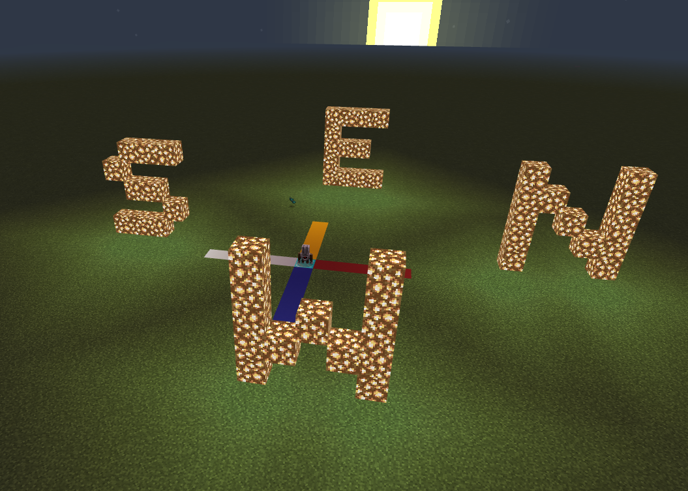 |

## Додаткові завдання

|            |                                                                                                                            |
| ---------- | -------------------------------------------------------------------------------------------------------------------------- |
| Завдання:  | Побудувати Компас на острові з піску та додати підписи напрямків світу, побудувати потрібно у відносних координатах гравця |
| Результат: | 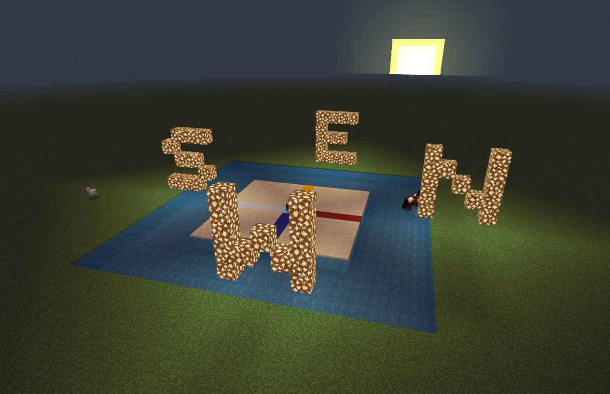                                                             |

## **Домашнє завдання**

### Завдання 1&#x20;

При команді чату “Океан” створіть воду від точки (40; -61; 40) до точки (-35; -61; -35). При команді чату “Ні” — «осушіть» океан (Світові координати)

### Завдання 2

Надрукувати свої ім’я Англійською з блоків вибухівки

### Завдання 3 (додаткове)

Ускладніть гру “Лабіринт” для Агента

### Завдання 4 (додаткове)

Придумати свою міні-гру у Майнкрафт


На наступному занятті продовжимо подорож Стародавньою Грецією і станемо на крок ближче до створення наступного дива світу! Також ви отримаєте навички, які стануть у нагоді для вашого проєкту😉

